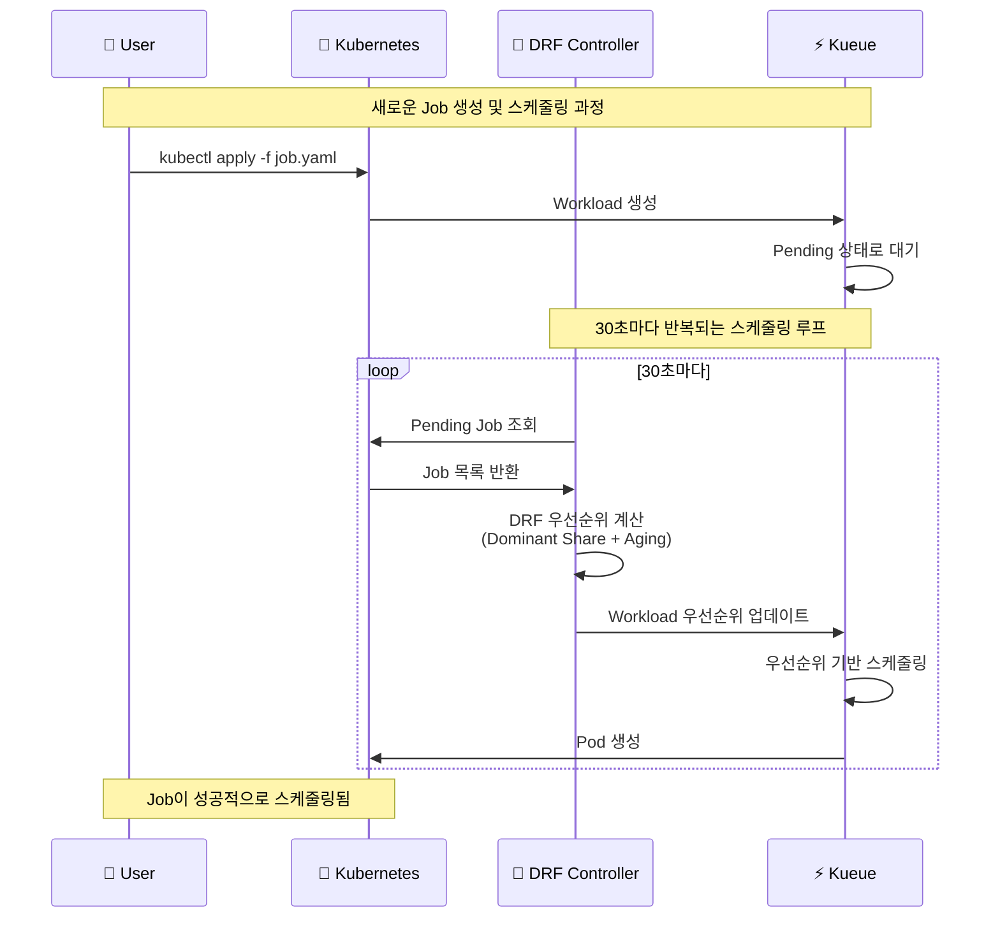

```mermaid
sequenceDiagram
    participant User as 👤 User
    participant K8S as 🐳 Kubernetes
    participant DRF as 🎯 DRF Controller
    participant Kueue as ⚡ Kueue
    
    Note over User,Kueue: 새로운 Job 생성 및 스케줄링 과정
    
    User->>K8S: kubectl apply -f job.yaml
    K8S->>Kueue: Workload 생성
    Kueue->>Kueue: Pending 상태로 대기
    
    Note over DRF,Kueue: 30초마다 반복되는 스케줄링 루프
    
    loop 30초마다
        DRF->>K8S: Pending Job 조회
        K8S->>DRF: Job 목록 반환
        DRF->>DRF: DRF 우선순위 계산<br/>(Dominant Share + Aging)
        DRF->>Kueue: Workload 우선순위 업데이트
        Kueue->>Kueue: 우선순위 기반 스케줄링
        Kueue->>K8S: Pod 생성
    end
    
    Note over User,K8S: Job이 성공적으로 스케줄링됨
``` 