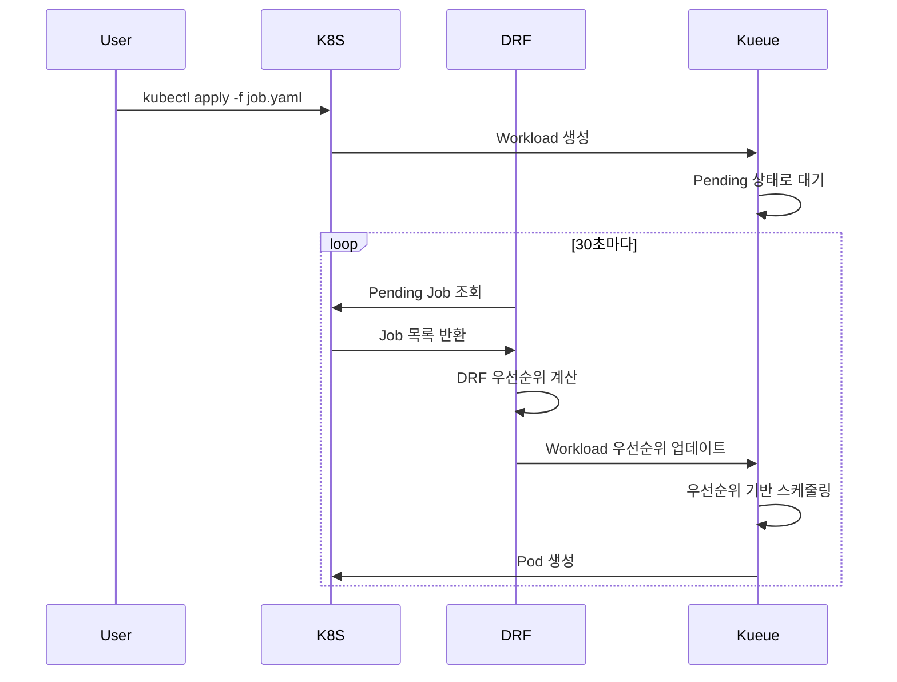

```mermaid
sequenceDiagram
    participant User
    participant K8S
    participant DRF
    participant Kueue
    
    User->>K8S: kubectl apply -f job.yaml
    K8S->>Kueue: Workload 생성
    Kueue->>Kueue: Pending 상태로 대기
    
    loop 30초마다
        DRF->>K8S: Pending Job 조회
        K8S->>DRF: Job 목록 반환
        DRF->>DRF: DRF 우선순위 계산
        DRF->>Kueue: Workload 우선순위 업데이트
        Kueue->>Kueue: 우선순위 기반 스케줄링
        Kueue->>K8S: Pod 생성
    end
``` 